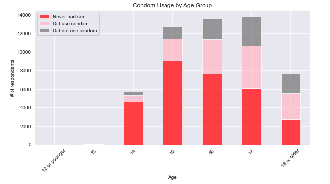
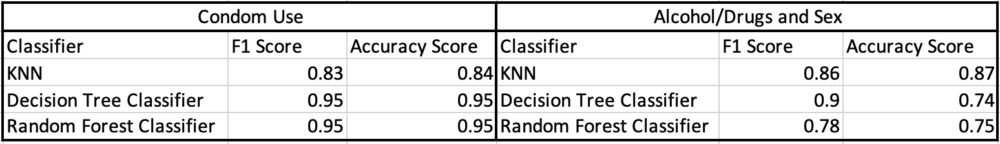
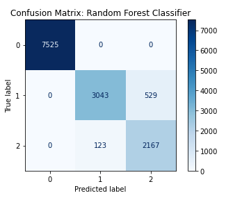

# YRBSS_Project

Youth Risk Behavior Surveillance System Classification Project

## Outline

## Overview
In order to conduct this research, we used the Youth Risk Behavior Surveillance System data published by the CDC in order to predict the likelihood of someone using safe sex practices. Our final model, with the best predictions, was a RandomForestClassifier. Our model contained 53 different features and resulted in an accuracy score of 95%.

## Business Problem
Behaviors developed at a young age can and often does follow us into adulthood. The Youth Risk Behavior Surveillance System (YRBSS) is the "largest public health surveillance system in the United States, monitoring a broad range of health-related behaviors among high school students," and allows researchers and others to study just how certain behaviors and actions can contribute to deteriorating mental health and risky sexual behaviors amongst other aspects of health. The surveys are conducted every two years at high schools across the country. The topics covered in the survey include behaviors which contribute to injury and violence, sexual behaviors, alcohol and drug use, tobacco use, dietary behaviors and physical activity. We look to determine which factors have a great bearing whether they may engage in risky sexual behavior.

## Data Sources
Below is where we acquired the CDC dataset, surveys, and additional information regarding YRBSS.
 - https://www.cdc.gov/healthyyouth/data/yrbs/data.htm
 
## Methods
In order to correct missing values, we first used domain driven methods. We engineered three features using existing columns which not only corrected null values but also helped the predictive power of our model. In addition to the feature engineering, we also used the SimpleImputer from sklearn in order to replace remaining null values in our DataFrame. 

We used two separate target variables to conduct our classification. Our target variables were 'Condom Use' and 'Alcohol/Drugs and sex'. We ran three different model to classify our data. Those models include KNN, DecisionTreeClassifier, and RandomForestClassifier. We evaluated our models using F1 scores and accuracy scores.

.jpg)

## Results
The Table below shows the breakdown of the evaluation metrics used to test our target variables.

The confusion matrix below displays the prediction results of our best model.

## Conclusion

## Recommendation

## Repository Contents
- `README.md`: The README for this repo branch explaining it's contents - you're reading it now
- `dsc-phase1-project-template.ipynb`: A starter Jupyter Notebook with headings, code examples and guiding questions
- `DS_Project_Presentation_Template.pdf`: A starter slide deck presenting your project - here is an [editable version](https://docs.google.com/presentation/d/1PaiH1bleXnhiPjTPsAXQSiAK0nkaRlseQIr_Yb-0mz0/copy)
- `__init__.py`: Python helper file that tells Python that there are packages in the repository that can be imported
- `data` folder: A folder for the data you reference with your code
- `images` folder: A folder for the images you reference in your files
- `code` folder: A folder for the python scripts that your Jupyter Notebook imports
  - `__init__.py`: Python helper file that tells Python that there are packages in this folder that can be imported
  - `data_cleaning.py`: Code to prepare data for analysis
  - `visualizations.py`: Code to produce visualizations
  - `eda_notebook.ipynb`: Notebook with any messy EDA so the main notebook can be more readable
- `.gitignore`: A hidden file that tells git to not track certain files and folders
