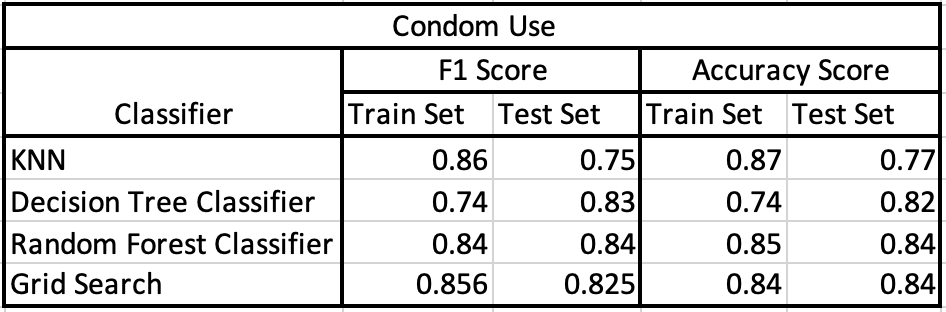
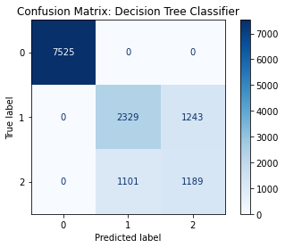
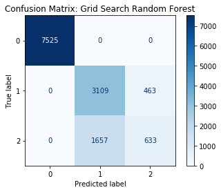

# YRBSS_Project

Youth Risk Behavior Surveillance System Classification Project

## Table of Contents
 - Overview
 - Business Problem
 - Data Sources
 - Methods
 - Results
 - Conclusion
 - Recommendation
 - Repository Contents

## Overview
In order to conduct this research, we used the Youth Risk Behavior Surveillance System data published by the CDC in order to predict the likelihood of someone using safe sex practices. Our final model, with the best predictions, was a RandomForestClassifier.

## Business Problem
Behaviors developed at a young age can and often does follow us into adulthood. The Youth Risk Behavior Surveillance System (YRBSS) is the "largest public health surveillance system in the United States, monitoring a broad range of health-related behaviors among high school students," and allows researchers and others to study just how certain behaviors and actions can contribute to deteriorating mental health and risky sexual behaviors amongst other aspects of health. The surveys are conducted every two years at high schools across the country. The topics covered in the survey include behaviors which contribute to injury and violence, sexual behaviors, alcohol and drug use, tobacco use, dietary behaviors and physical activity. We look to determine which factors have a great bearing whether they may engage in risky sexual behavior.

## Data Sources
Below is where we acquired the CDC dataset, surveys, and additional information regarding YRBSS.
 - https://www.cdc.gov/healthyyouth/data/yrbs/data.htm
 
## Methods
In order to correct missing values, we first used domain driven methods. We engineered three features using existing columns which not only corrected null values but also helped the predictive power of our model. In addition to the feature engineering, we also used the SimpleImputer from sklearn in order to replace remaining null values in our DataFrame. 

We used two separate target variables to conduct our classification. Our target variables were 'Condom Use' and 'Alcohol/Drugs and sex'. We ran three different model to classify our data. Those models include KNN, DecisionTreeClassifier, and RandomForestClassifier. We evaluated our models using F1 scores and accuracy scores.

.jpg)

## Results
The Table below shows the breakdown of the evaluation metrics used to test our target variables.

The confusion matrices below display the predictions for our best two models. The Decision Tree classifier was better than Random Forest at predicting which students were not using condoms. For that reason, we favor the decision tree model, since our greater concern is predicting those who will engage in unsafe sex practices and this model allows us to specify those specific students.

## Conclusion
Given the results of our models we chose the Random Forest Classifier as our final model. After reviewing the F1 and Accuracy scores of the model,  in addition to the confusion matrix, we have concluded that this model provided the strongest predictive power when trying to determine if someone will follow safe sex practices.

## Recommendation
Given our findings, we recommend that students who engage in underage drug and alcohol use should be discouraged from engaging in unsafe sex practices to do the risk of adverse outcomes such as disease and teen-pregnancy. Teens with multiple sex partners, in addition to those who have had sex under the age of thirteen are most at risk of practice unsafe sex. Adequate education on the dangers of sex should be reinforced to teens during this vulnerable stage in their life to avoid developing unsafe sex practices.

## Repository Contents
- `code` folder: A folder for the python scripts that your Jupyter Notebook imports
  - `FE_and_DL_Final.ipynb`: Code to prepare data for analysis
  - `Modeling_Final_notebook.ipynb`: Code to prepare data for analysis
  - `Visualizations_.ipynb`: Code to produce visualizations
  - `RandomForestClassifier.ipynb`: Notebook with final RandomForestClassifier
- `data` folder: A folder for the data you reference with your code
- `readme_images`: A folder containing images you see in this readme
- `.gitignore`: A hidden file that tells git to not track certain files and folders
- `README.md`: The README for this repo branch explaining it's contents - you're reading it now
